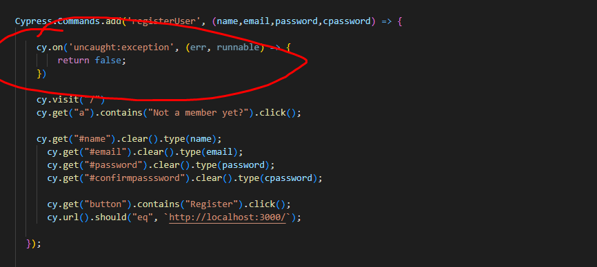
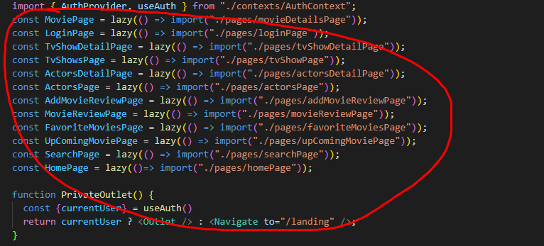
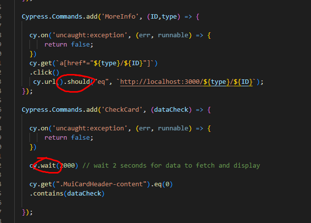

# Assignment 1 - Agile Software Practice.

__Name:__ Daniel Marko

This repository contains the implementation of a React App and its associated Cypress tests and GitLab CI pipeline.

## React App Features.
 
+ Firebase Authentication
+ Popular TV Show page
+ Popular Actors page
+ Detailed TV Show
+ List of Similar TV Shows
+ Detailed Actor Page
+ List of Shows + Movies the Actor has been in
+ Genre Filter for Movies
+ Genre Filter for TV Shows
+ Searching Movies 
+ Searching TV Shows
+ Searching Actors
+ Pagination
+ Caching

## Automated Tests.

### Best test cases.

+ cypress/e2e/reviewTest.cy.js
+ cypress/e2e/actorCredits.cy.js

### Cypress Custom commands (if relevant).

+ actorCredits.cy.js
+ loginUser.cy.js
+ movieGenre.cy.js
+ registeringUser.cy.js
+ reviewTest.cy.js
+ searchActor.cy.js
+ searchMovie.cy.js
+ searchTVShow.cy.js
+ tvshowGenre.cy.js
+ tvshowSimilaritytest.cy.js

## Code Splitting.

+ src/index.js

## Pull Requests.

https://github.com/daniel12331/agile-assignment

## Independent learning (If relevant).

+ Custom Commands / Error Handling - cypress/support/command - Custom cypress commands that are reused in some of the tests, implemented with error handling also

+ Code Splitting - src/index

+ Using new cypress functionality - cypress/support/command - Using new cypress functionality like .should(), .wait().....
